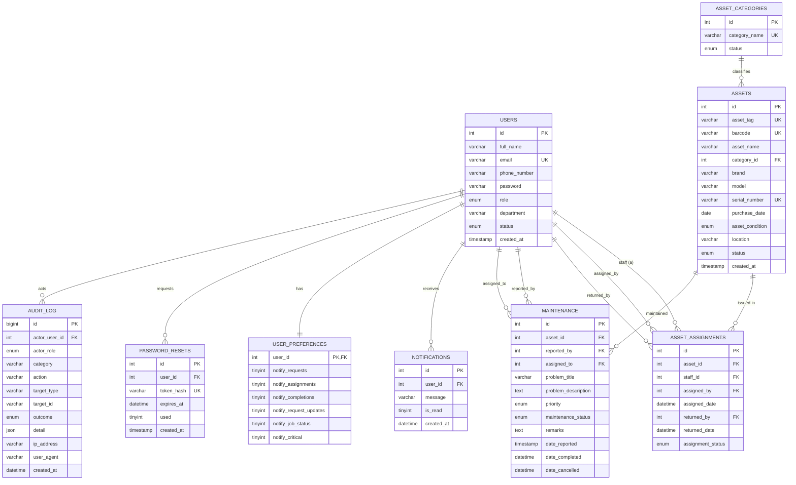

# IAMTS — Entity Relationship Diagram (ERD) & Database Design

**Project:** ICT Assets Maintenance & Tracking System (IAMTS)

This document describes the database design (CSC 394 – Database Management).
The system uses **MySQL 8.0** as its DBMS. The schema is fully normalized to
**Third Normal Form (3NF)**, uses **InnoDB** tables, foreign-key integrity
constraints, and indexed columns for query performance.

---

## 1. Table Overview

| Table               | Purpose                                                        |
|---------------------|----------------------------------------------------------------|
| `users`             | System accounts (Admin, Technician, Staff)                     |
| `asset_categories`  | Classification of ICT assets (laptop, printer, server, …)      |
| `assets`            | ICT assets owned by the organization                           |
| `asset_assignments` | Issuing and returning assets to staff                          |
| `maintenance`       | Maintenance / repair request workflow                          |
| `notifications`     | Per-user notification messages                                 |
| `user_preferences`  | Per-user opt-in flags for notification categories              |
| `password_resets`   | One-time, time-limited password reset tokens (stored hashed)   |
| `audit_log`         | Append-only security & state-change audit trail                |

---

## 2. Entity Relationship Diagram

### 2a. Mermaid (renders in GitHub / many Markdown viewers)



### 2b. ASCII fallback (for PDF / Word export)

```
users                 <-► asset_categories
  │ 1         * assets
  │                │ 1
  │                │ *
  │          asset_assignments
  │                ▲         *
  │ 1    *        │ users (assigned_by / returned_by)
  │          * assets
  ├─► maintenance
  │                * users (reported_by / assigned_to)
  │
  ├─► notifications * users
  ├─► user_preferences (1:1 with users)
  ├─► password_resets * users
  └─► audit_log * users
```

---

## 3. Relationships and Cardinality

| Relationship                          | Cardinality | Foreign Key(s)                          |
|---------------------------------------|-------------|------------------------------------------|
| `asset_categories` → `assets`         | 1 : N       | `assets.category_id`                     |
| `assets` → `asset_assignments`        | 1 : N       | `asset_assignments.asset_id`             |
| `users` → `asset_assignments` (staff) | 1 : N       | `asset_assignments.staff_id`             |
| `users` → `asset_assignments` (issued)| 1 : N       | `asset_assignments.assigned_by`          |
| `users` → `asset_assignments` (return)| 1 : N       | `asset_assignments.returned_by`          |
| `assets` → `maintenance`              | 1 : N       | `maintenance.asset_id`                   |
| `users` → `maintenance` (reporter)    | 1 : N       | `maintenance.reported_by`                |
| `users` → `maintenance` (technician)  | 1 : N       | `maintenance.assigned_to`                |
| `users` → `notifications`             | 1 : N       | `notifications.user_id`                  |
| `users` → `user_preferences`          | 1 : 1       | `user_preferences.user_id` (PK/FK)       |
| `users` → `password_resets`           | 1 : N       | `password_resets.user_id`                |
| `users` → `audit_log`                 | 1 : N       | `audit_log.actor_user_id`                |

---

## 4. Design Decisions

1. **Third Normal Form (3NF)** – No transitive dependencies; every non-key
   attribute depends only on the whole primary key. E.g., asset details live
   only in `assets` and are referenced by foreign key elsewhere.
2. **Referential integrity** – `ON DELETE CASCADE` on child tables where
   orphans are meaningless (`user_preferences`, `password_resets`), and
   `ON DELETE SET NULL` for audit actors so the audit trail is never lost.
3. **Enums for constrained domains** – Roles, statuses, and priorities are
   stored as MySQL `ENUM` types to prevent invalid values at the database layer.
4. **Sensitive data handling** –
   - Passwords: bcrypt hash (10 rounds) in `users.password`.
   - Reset tokens: only the SHA-256 **hash** in `password_resets.token_hash`;
     raw tokens are never persisted.
   - Audit `detail` is an allowlisted JSON value set; it never stores secrets.
5. **Indexing** – Foreign-key and filter columns are indexed (e.g.,
   `notifications.user_id`, `audit_log.created_at`) to keep reporting queries fast.
6. **Append-only audit** – `audit_log` rows are only inserted by the server and
   purged on a schedule; no application path updates or deletes them.

---

## 5. Sample Queries (defense-ready)

**Total assets grouped by status**
```sql
SELECT status, COUNT(*) AS total
FROM assets
GROUP BY status
ORDER BY total DESC;
```

**Open (pending/in-progress) maintenance requests**
```sql
SELECT a.asset_name, m.problem_title, m.priority, m.maintenance_status
FROM maintenance m
JOIN assets a ON a.id = m.asset_id
WHERE m.maintenance_status IN ('Pending', 'In Progress')
ORDER BY m.date_reported;
```

**Technician workload**
```sql
SELECT u.full_name AS technician,
       COUNT(m.id) AS jobs_assigned,
       SUM(CASE WHEN m.maintenance_status = 'In Progress' THEN 1 ELSE 0 END) AS in_progress,
       SUM(CASE WHEN m.maintenance_status = 'Completed' THEN 1 ELSE 0 END) AS completed
FROM maintenance m
JOIN users u ON u.id = m.assigned_to
GROUP BY u.id
ORDER BY jobs_assigned DESC;
```

**Validation queries (referential integrity)**
```sql
-- Assets assigned to a specific staff member
SELECT a.asset_name, a.asset_tag, aa.assigned_date
FROM asset_assignments aa
JOIN assets a ON a.id = aa.asset_id
JOIN users u ON u.id = aa.staff_id
WHERE u.email = 'aogunleye@iamts.com'
  AND aa.assignment_status = 'Assigned';
```
